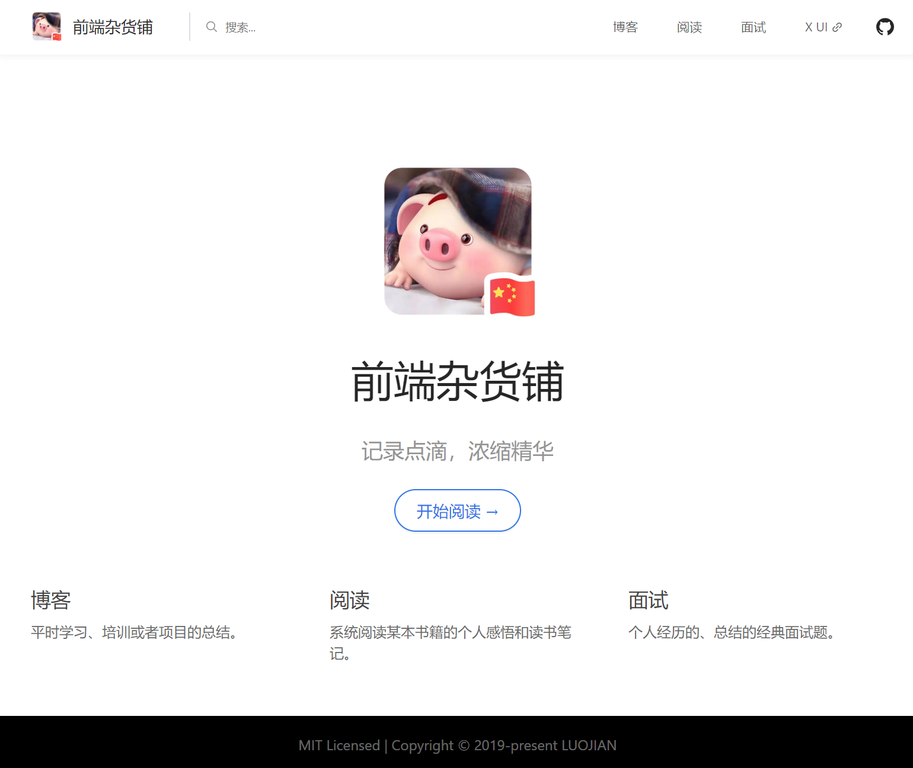
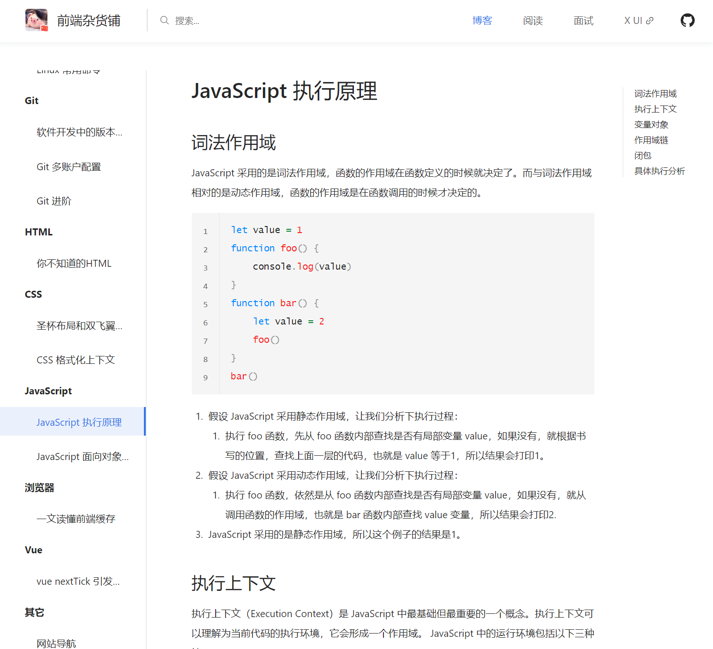

<h1 align="center">

An Ant Design style theme for VuePress.

</h1>

> demo 地址：<https://whu-luojian.github.io>

## Features
- 1:1 还原 Ant Design 官网风格，搭载 Ant Design of Vue 组件, 支持在 Markdown 文件中直接使用 Ant Design 组件.
- 统一预处理器，使用 Ant Design 设计规范的 Less 样式

## Quick start

### Install theme

```sh
npm i vuepress-theme-antdesign
```
or
```sh
yarn add vuepress-theme-antdesign
```

### Use theme  

在 `.vuepress/config.js` 文件中指定主题:
```js
module.exports = {
  theme: 'antdesign'
}
```
其他配置跟 vuepress 默认保持一致，参考： 
- [Using a theme](https://vuepress.vuejs.org/theme/using-a-theme.html#theme-shorthand)
- [Theme Config](https://vuepress.vuejs.org/theme/default-theme-config.html)
- [Theme Style](https://vuepress.vuejs.org/zh/config/#styling)

### palette

**注意样式覆盖需采用 less 语法**
如果要对默认预设的样式进行简单的替换，或者定义一些变量供以后使用，你可以创建一个 .vuepress/styles/palette.less 文件。
你可以调整的一些变量如下:

```less
  // 颜色
  @accentColor: #1890ff;
  @textColor: rgba(0, 0, 0, 0.85);
  @borderColor: #eaecef;
  @codeBgColor: #f5f5f5;

  // 布局
  @navbarHeight: 64px;
  @homePageWidth: 960px;

  // 响应变化点
  @MQNarrow: 992px;
  @MQMobile: 767px;
  @MQMobileNarrow: 575px;
```

## preview
<p align="center"></p>
<p align="center"></p>
